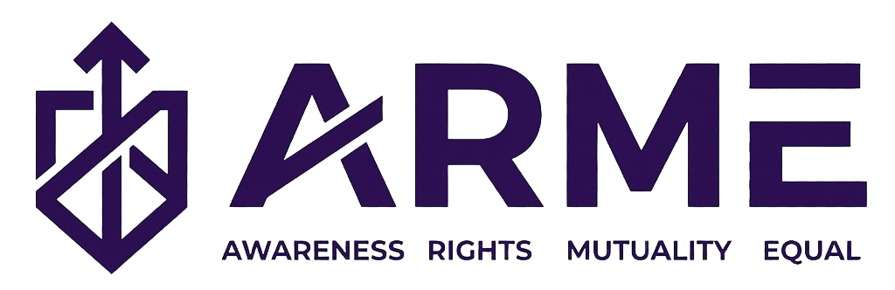

# ARME — Awareness, Rights, Mutuality, Equality 🌍



ARME, Birleşmiş Milletler **Sürdürülebilir Kalkınma Amacı 5 (SDG 5): Toplumsal Cinsiyet Eşitliği** hedefleri doğrultusunda geliştirilmiş, interaktif ve modern bir web portalıdır. Kadınlara yönelik ayrımcılığı sona erdirmeyi, eğitim ve iş fırsatlarında eşitliğe dikkat çekmeyi amaçlayan veri odaklı ve yapay zeka destekli bir platform sunar.

## 🌟 Öne Çıkan Özellikler

- **🤖 Akıllı Yapay Zeka Asistanı (Gemini AI):** Sadece toplumsal cinsiyet eşitliği ve SDG 5 hakkında bilgi veren, konu dışı soruları ustalıkla reddeden ve Google Gemini SDK entegrasyonu ile çalışan özel eğitilmiş bir sohbet botu.
- **🎮 İnteraktif Farkındalık Oyunu:** Senaryo tabanlı karar ağacı mekaniği ile kullanıcılara günlük hayatta karşılaşılan eşitsizlik durumlarında kararlar aldırıp sonuçlarını istatistiksel olarak sunan eğitici mini oyun.
- **📰 Güncel Kaynak Akışı:** UN Women, Global Compact, CEİD gibi güvenilir kurumlardan derlenen güncel sürdürülebilirlik raporları ve haber kaynakları modülü.
- **📱 Kusursuz Mobil Uyumluluk:** Her cihaza ve ekran boyutuna duyarlı (responsive) tasarım, dinamik hamburger menü ve "glassmorphism" modern web estetiği.
- **🌐 Çoklu Dil Desteği (TR/EN):** Entegre Google Translate altyapısı sayesinde tek tıkla sayfa düzeni bozulmadan İngilizce - Türkçe arasında geçiş imkanı.

## 🛠 Kullanılan Teknolojiler

- **Frontend:** HTML5, CSS3 (Modern Vanilla CSS & CSS Değişkenleri), JavaScript (ES6+)
- **Yapay Zeka:** Google Gemini API (`generativelanguage.googleapis.com/v1beta`)
- **İkonlar & Fontlar:** FontAwesome 6, Google Fonts (Inter)
- **Ekstra Özellikler:** Dinamik DOM manipülasyonu, Particle (Parçacık) animasyonlu Hero ekranı.

## 📂 Proje Yapısı

```text
sdg5-website/
├── index.html            # Ana sayfa (Hero ekranı, istatistikler, özellik kartları)
├── hakkimizda.html       # Misyon ve vizyon açıklamaları
├── bilgilendirme.html    # Güncel haber kaynakları
├── sorular.html          # Gemini AI Chatbot ekranı
├── iletisim.html         # İletişim formu ve proje ekibi
├── styles.css            # Projenin tüm stil kuralları (Responsive, Dark Mode)
├── app.js                # AI Asistanı, Çeviri butonu, API yapılandırması
├── game.js               # İnteraktif Farkındalık Oyunu mantığı
├── env.js                # API Anahtarlarını tutan güvenli yapılandırma (GitHub'a eklenmez)
└── arme-logo.png         # Proje Logosu
```

## 🚀 Kurulum ve Çalıştırma

Projenin herhangi bir sunucu arka planına (Node.js vb.) ihtiyacı yoktur. Ancak yapay zeka asistanının çalışması için kendi Gemini API anahtarınızı tanımlamanız gerekmektedir.

1. Projeyi bilgisayarınıza klonlayın:
   ```bash
   git clone https://github.com/kadir465/ARME.git
   ```
2. Proje dizinine gidin:
   ```bash
   cd ARME/sdg5-website
   ```
3. `env.js` adında bir dosya oluşturun ve içine şu kodu ekleyip kendi API anahtarınızı girin:
   ```javascript
   const ARME_CONFIG = {
       GEMINI_API_KEY: "SİZİN_API_ANAHTARINIZ_BURAYA_GELECEK"
   };
   ```
4. `index.html` dosyasını favori web tarayıcınızda (Chrome, Firefox, Safari) açarak projeyi anında incelemeye başlayabilirsiniz. Daha iyi bir deneyim için VS Code üzerinden "Live Server" eklentisini kullanabilirsiniz.

## 🤝 Ekip & İletişim
Dokuz Eylül Üniversitesi, 2026

Proje geliştiricileriyle iletişime geçmek için **İletişim** sayfasını ziyaret edebilir veya mail adreslerimiz üzerinden bize ulaşabilirsiniz. Sürdürülebilir bir gelecek ve eşitlik için birlikte çalışalım!
